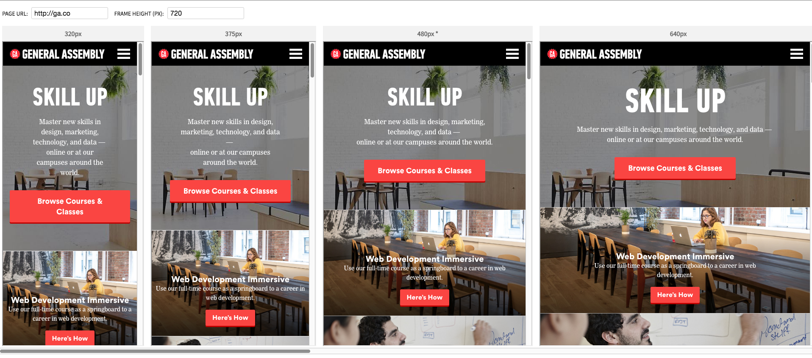

# React Responsive Viewer
A simple way to load up a proxied whitelist (to bypass x-frame-options) of hosts into multiple iframes for testing responsive layouts. Also a fun trial with react.js
## Installation
`npm install`

## Usage
1. `npm run build`
2. `npm start`
3. Visit `http://localhost:8080`
4. Adjust height to your liking
5. Browse a different host/page that you've whitelisted

## Preview

## Todo
1. Hotload react
2. livereload/browserify dev experience
3. Add additional breakpoints at will
4. Clean up some stuff
